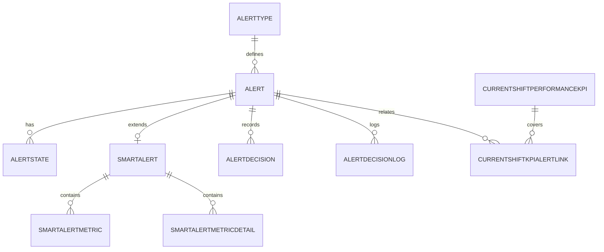

# TrueView Alerts Schema (including Decision Logs and Current Shift KPI)

## Purpose
This document outlines a practical relational schema for TrueView-style alerts, including:
- core alert records
- smart-alert enrichment and status
- decision/action audit history
- current-shift performance KPI tracking

The design aligns with the alert concepts already observed in the current inventory, especially the shared alert core and smart-alert extensions.

## 1. Core Alert Model

### 1.1 Alert
Stores the canonical alert instance for both standard and smart alerts.

| Column | Type | Notes |
|---|---|---|
| AlertId | bigint | PK |
| SiteCode | varchar(50) | Site context |
| AlertTypeId | int | FK to AlertType |
| AlertTypeCode | varchar(100) | E.g. BlastDelay, CycleTime |
| AlertTitle | nvarchar(200) | Display title |
| AlertMessage | nvarchar(4000) | Narrative / description |
| Severity | int | Low/Medium/High/Critical |
| IsActive | bit | Whether the alert is currently active |
| IsActionable | bit | Whether the alert should be shown as actionable |
| SourceSystem | varchar(100) | Generator or source job |
| CreatedAt | datetime2 | First observed/raised |
| UpdatedAt | datetime2 | Last update |
| ClosedAt | datetime2 | When cleared / resolved |
| SourceTimestamp | datetime2 | Source event time |

### 1.2 AlertType
Reference table for alert definitions and configuration defaults.

| Column | Type | Notes |
|---|---|---|
| AlertTypeId | int | PK |
| Code | varchar(100) | Unique alert type code |
| Category | varchar(100) | e.g. Standard, Smart, Equipment, Mine |
| DisplayName | nvarchar(200) | Friendly name |
| DefaultSeverity | int | Default severity |
| IsSmartAlert | bit | Smart-alert flag |
| IsEnabled | bit | Enabled for generation |
| CreatedAt | datetime2 | |

### 1.3 AlertState
Optional state table for recurring or de-duplicated alert behavior.

| Column | Type | Notes |
|---|---|---|
| AlertStateId | bigint | PK |
| AlertId | bigint | FK to Alert |
| SiteCode | varchar(50) | |
| StateCode | varchar(100) | e.g. Snoozed, Suppressed, Active |
| StateValue | nvarchar(500) | Optional state payload |
| LastUpdatedAt | datetime2 | |

## 2. Smart Alert Extension Model

### 2.1 SmartAlert
Stores smart-alert lifecycle and decision metadata.

| Column | Type | Notes |
|---|---|---|
| SmartAlertId | bigint | PK |
| AlertId | bigint | FK to Alert |
| StatusCode | varchar(50) | New, Acknowledged, Actioned, Closed |
| ReasonCode | varchar(100) | Why the alert was raised |
| ActionCode | varchar(100) | Recommended or selected action |
| SubmittedByUserId | bigint | User who acknowledged / acted |
| SubmittedAt | datetime2 | Action submission time |
| Notes | nvarchar(4000) | Free-form comment |
| CreatedAt | datetime2 | |
| UpdatedAt | datetime2 | |

### 2.2 SmartAlertMetric
Stores structured metrics for smart alerts.

| Column | Type | Notes |
|---|---|---|
| SmartAlertMetricId | bigint | PK |
| SmartAlertId | bigint | FK to SmartAlert |
| MetricName | varchar(200) | e.g. QueueTime, DigUnitRate |
| MetricValue | decimal(18,4) | Numeric value |
| Unit | varchar(50) | e.g. mins, %, t/h |
| MetricTimestamp | datetime2 | Time of metric capture |
| PayloadJson | nvarchar(max) | Optional raw structure |

### 2.3 SmartAlertMetricDetail
Optional table for specialized smart-alert metrics that need a normalized shape.

| Column | Type | Notes |
|---|---|---|
| SmartAlertMetricDetailId | bigint | PK |
| SmartAlertId | bigint | FK to SmartAlert |
| MetricType | varchar(100) | e.g. CycleTime, QueueTime |
| MetricGroup | varchar(100) | e.g. Crusher, Haul, Drill |
| MetricJson | nvarchar(max) | Normalized detail payload |
| CreatedAt | datetime2 | |

## 3. Decision and Audit Logging

### 3.1 AlertDecision
Represents the decision associated with an alert and its resolution path.

| Column | Type | Notes |
|---|---|---|
| AlertDecisionId | bigint | PK |
| AlertId | bigint | FK to Alert |
| DecisionType | varchar(100) | Acknowledge, Escalate, Suppress, Ignore, Action |
| DecisionCode | varchar(100) | Optional machine-friendly decision code |
| DecisionSummary | nvarchar(500) | Short summary |
| DecisionDescription | nvarchar(4000) | Full explanation |
| DecisionByUserId | bigint | User who made the decision |
| DecisionAt | datetime2 | Timestamp |
| IsFinal | bit | Whether this is final resolution |
| CreatedAt | datetime2 | |

### 3.2 AlertDecisionLog
Append-only audit trail for every change against an alert decision or lifecycle.

| Column | Type | Notes |
|---|---|---|
| AlertDecisionLogId | bigint | PK |
| AlertId | bigint | FK to Alert |
| AlertDecisionId | bigint | FK to AlertDecision, nullable |
| EventType | varchar(100) | Raised, Updated, Acknowledged, Reopened, Closed, Escalated |
| EventMessage | nvarchar(4000) | Human-readable event log |
| EventByUserId | bigint | User or system who caused event |
| EventSource | varchar(100) | UI, Job, API, Scheduler |
| EventAt | datetime2 | Timestamp |
| MetadataJson | nvarchar(max) | Optional structured context |

## 4. Current Shift KPI Model

### 4.1 CurrentShiftPerformanceKpi
Stores the current-shift KPI snapshot used for operational monitoring and alert context.

| Column | Type | Notes |
|---|---|---|
| CurrentShiftKpiId | bigint | PK |
| SiteCode | varchar(50) | |
| ShiftCode | varchar(50) | e.g. Day, Night |
| ShiftDate | date | Shift calendar date |
| StartTime | datetime2 | Shift start |
| EndTime | datetime2 | Shift end |
| TmmActual | decimal(18,4) | Total material mined |
| TmmPlan | decimal(18,4) | Planned target |
| AvailabilityPct | decimal(9,4) | Equipment availability |
| UtilizationPct | decimal(9,4) | Utilization |
| TruckCycleTimeMin | decimal(9,4) | Avg cycle time |
| QueueTimeMin | decimal(9,4) | Avg queue time |
| DigUnitRate | decimal(9,4) | Dig unit KPI |
| CrusherUtilizationPct | decimal(9,4) | |
| DrillPenetrationRate | decimal(9,4) | |
| CreatedAt | datetime2 | Snapshot time |
| UpdatedAt | datetime2 | |

### 4.2 CurrentShiftKpiAlertLink
Join table linking KPI snapshots to alerts that were raised during the same shift context.

| Column | Type | Notes |
|---|---|---|
| CurrentShiftKpiAlertLinkId | bigint | PK |
| CurrentShiftKpiId | bigint | FK to CurrentShiftPerformanceKpi |
| AlertId | bigint | FK to Alert |
| CreatedAt | datetime2 | |

## 5. Suggested Relationships

- AlertType 1:N Alert
- Alert 1:N AlertState
- Alert 1:N SmartAlert
- SmartAlert 1:N SmartAlertMetric
- SmartAlert 1:N SmartAlertMetricDetail
- Alert 1:N AlertDecision
- Alert 1:N AlertDecisionLog
- CurrentShiftPerformanceKpi 1:N CurrentShiftKpiAlertLink
- Alert 1:N CurrentShiftKpiAlertLink

## 6. Recommended ER Diagram

## 7. Implementation Notes
- Keep Alert as the single canonical entity for list/detail APIs.
- Use SmartAlert for actionability and decision lifecycle only.
- Make AlertDecisionLog append-only for auditability.
- Store CurrentShiftPerformanceKpi as a point-in-time snapshot so trend and incident analysis remain reproducible.
- If needed, add a SiteShift table later to normalize shift windows and shift roster context.
